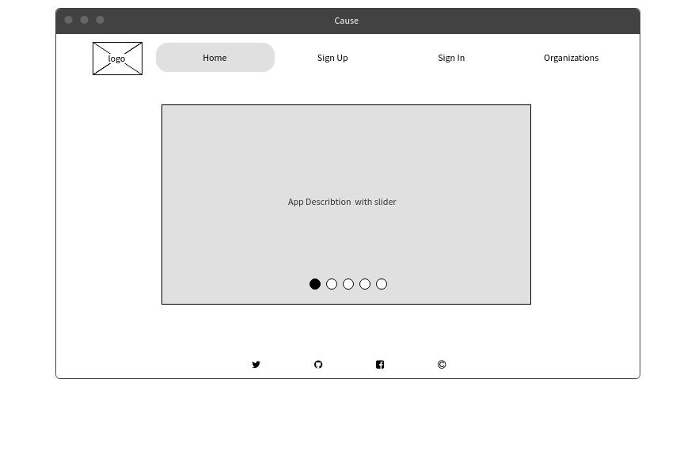
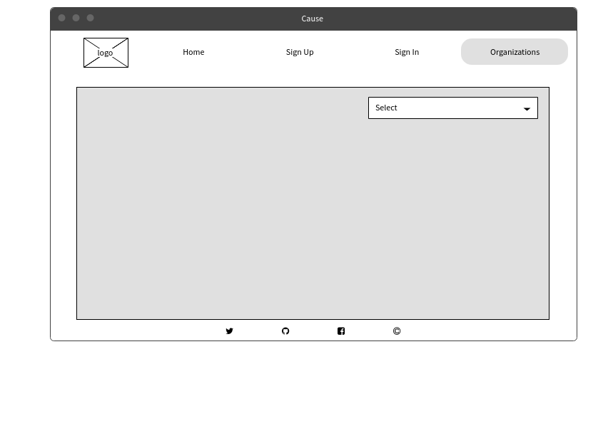
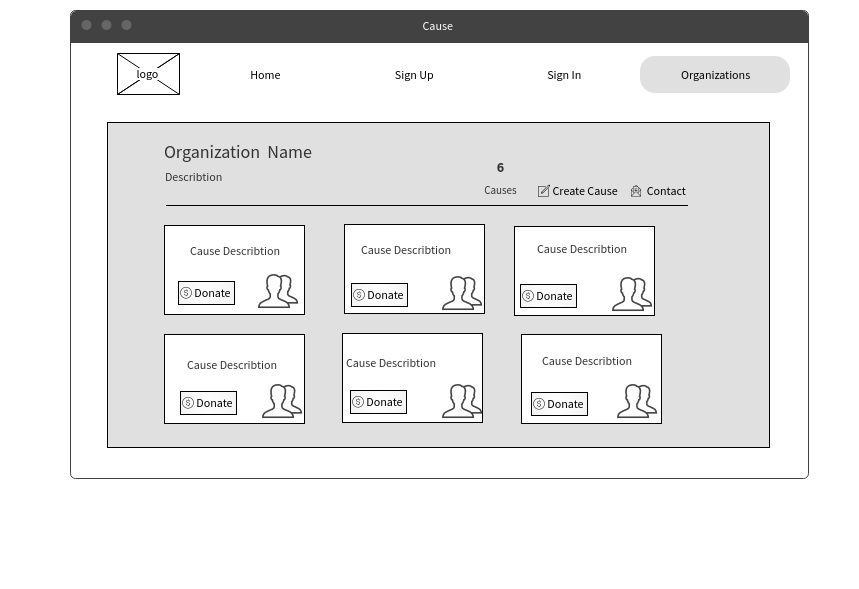

# Let's Support:
This app is a platform for everyone who wants to make the would a better place. This app helps to you, your community, the world, and planet earth. It is a platform that connects organizations and supports together to make a change in real life. *Let's Support* empower your cause and change it to better.

# User Stories:

## Organization's Story
- As an organization, I want to have an account to create multiple causes. I want to the ability to update and edit my information and my causes. I want to have a profile to describe my organization and provide more information. I also want to stop cause campaigns. I want supporters to able to support to my causes.

## Supporter's Story
- As a supporter, I want to have an account that I can view multiple causes and view cause's organizations. I want to support these causes and see other supporters comments. I want to have a profile that I can my password, name, and email.

# Wireframes:

# Entity Relationship Diagram's (ERD):

# Used Tools:
- Rails
- Ruby
- Bootstrap
- GitHub
- Devise
- JavaScript

# Technical Difficulty:
We had an issue that caused us delays and errors nested routing. However it was solved by using regular routing and passing the cause id in the params

# Future Plan:
- Organization can receive actual donations, and can refund supporter's donations.
- Organization can have followers and update them about their news.
- Supporter can have show their donations to in their profile.
- Supporter can follow organizations and get followed by other supporters.
